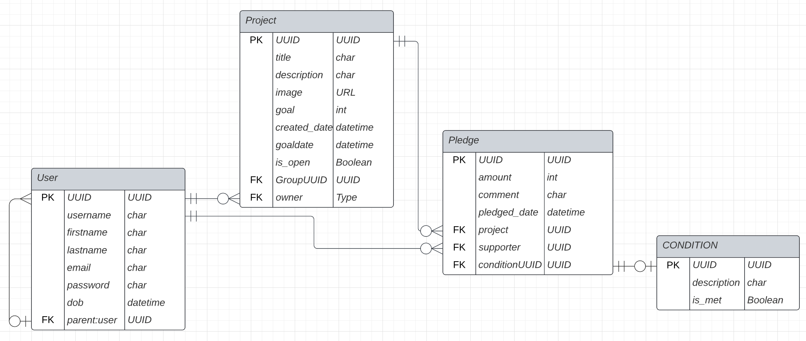
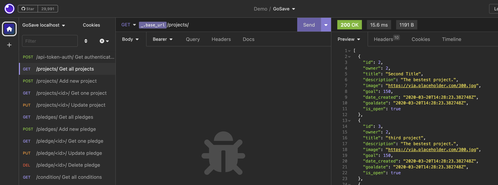
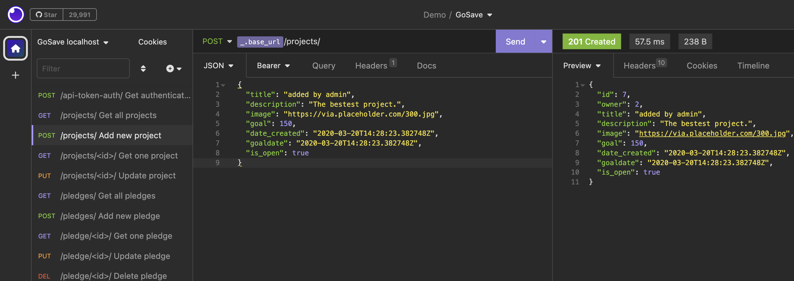
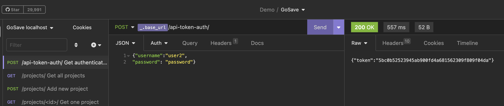

# GoSave - helping children reach their goals
[GoSave](https://gosave.fly.dev/)

by Leah Taylor

# She Codes crowdfunding project - DRF Backend

# Project Brief
Create the back end for a crowdfunding project. The project must have user account functionality, ability to create projects and pledges, relevant permissions, and returning relevant codes for successful and unsuccessful attempts to the API. 

## About
This project was inspired by my son wanting to save up for an $800 Apple watch. He has asked if he can have money for birthdays and Christmases so he can save up, but once the cash is in hand it is all too easy to spend it. I thought what if family and friends could contribute to a savings goal online by posting pledges, to be released by the parent once the goal is met. The idea grew into a way of encouraging children to contribute at home or meet other goals such as homework or schoolgrades, by adding conditions to pledges ("I'll donate $50 if you get an A" or "$5 if you mow the lawnn".)

## Features
* [x] Users can register on the app and log in (see database schema for user attributes)
* [x] Users can create new projects (see db schema for attributes)
* [x] Users can create pledges for a project 
* [x] Users can update their own projects and pledges
* [x] Users can delete their own pledges and/or conditions
* [x] Permissions to ensure only owners of a project or pledge can update it
* [x] Graceful handling of failed requests e.g. 404 page
* [x] Uses Token Authentication
 
### Stretch goals
* [x] Users can be associated with a parent user
* [x] A pledge can have an optional condition attached to it (this was a stretch goal that I implemented)
  
### Permissions to post, update or delete conditions
I did not have time to implement permissioning around posting, updating or deleting conditions. The condition itself does not have an owner associated with it and I will need to retrieve the owner of the pledge the condition is associated with. 

### Not yet implemented:
* [ ] **Group functionality, for privacy**:
    - Each project must belong to a group
    - Users over 18, and parents, can invite other people to register as members of a group
    - Only members of a group can view a project and submit pledges to it
    - Users can be members of multiple groups  
**Other**
* [ ] Users under 18 require a parent to approve and oversee their account
* [ ] Users can delete projects (requires workflow around refunding pledges)
* [ ] Users can update their user account details
* [ ] Permissioning around retrieving a user's details

### Ideas for Future Functionality
- Responsible citizenship - Giving Pots, where they can donate a % of pledges to a good cause
- Goal completion tracker - number of days to birthday / goal target date
- Repeating chore lists, where children can earn weekly pocket money towards their goal
- Alignment with the Barefoot Investor for Kids philosophy, providing a learning journey for children to develop good money habits
- Payment gateway / functionality

## Database Schema



I implemented two stretch goals on my database schema;
1. **For users that are children, their account needs to be associated with a parent**. I considered having parents and children in separate tables, but decided this would not work well because there's then two tables of users, which makes permissioning/authentication complex, and when children become 18 they'd have to migrate tables. 

    After extensive research I decided the best approach was to use a self referencing foreign key, with the parent_ID being a foreign key attribute on a user_ID record. This would associate a separate parent user with a child user. *Please note there is not yet any functionality to check age upon user registration or to enforce the association of a parent record for a child user*. The solution I used came from the [Django Cookbook](https://books.agiliq.com/projects/django-orm-cookbook/en/latest/self_fk.html#).

2. **Creating optional conditions on pledges**. I decided early on to create a separate table for conditions, in alignment with best practice for database design. Firstly, most pledges would not have conditions; and secondly, having condition attributes as part of the general pledge attributes would result in two dependent attributes (condition description, condition met). 
   
    I created two separate models for Pledge and Condition with a OneToOne relationship between them. In order to bring a join to the tables when retrieving pledges in the views, This meant, in order to retrieve a condition associated with a pledge, I used `select_related`:
`pledge = Pledge.objects.select_related('condition').get(pk=pk)`

## API Specification

| HTTP Method | Url | Purpose | Request Body | Successful Response Code | Authentication <br /> Authorization
| --- | ------- | ------ | ---- | -----| ----|
| POST | /api-token-auth/ | Get authentication token | user object | 200 | Must be valid credentials. |
| GET | /projects/ | Return all projects | N/A | 200 | N/A |
| POST | /projects/ | Create new project | project object | 201 | User must be logged in. |
| GET | /projects/id/ | Return one project | N/A | 200 | N/A | 
| PUT | /projects/id/ | Update one project | project object | 204 | Must be logged in.<br />Must be project owner.| 
| GET | /pledges/ | Return all pledges | N/A | 200 | N/A |
| POST | /pledges/ | Create new pledge | pledge object | 201 | Must be logged in.|
| GET | /pledge/id/ | Return one pledge | N/A | 200 | N/A |
| PUT** | /pledge/id/ | Update one pledge | pledge object | 204 | Must be logged in.<br />Must be pledge submitter.|
| DELETE | /pledge/id/ | Delete one pledge (and associated condition) | N/A | 204 |  Must be logged in.<br />Must be pledge submitter.|
| GET | /conditions/ | Return all conditions | N/A | 200 | N/A|
| POST | /conditions/ | Create new condition | condition object | 201 | Must be logged in. |
| GET | /condition/id/ | Return one condition | N/A | 200 | N/A |
| PUT | /condition/id/ | Update one condition | condition object | 204 | Must be logged in.|
| DELETE | /condition/id/ | Delete a condition | N/A | 204 | Must be logged in. |
| GET | /users/ | Return all users | N/A | 200 | (not yet) |
| POST | /users/ | Create user | user object | 200 | N/A |
| GET | /user/id/ | Return one user | N/A | 200 | (not yet) |

Note that the endpoints for creating/updating pledges and their associated conditions were kept separate. The front end will send two requests when a pledge is created or updated with a condition. 

 ** *Known bug* - updating pledges currently results in a RelatedObjectDoesNotExist error. This was only discovered during final testing, and I was not able to resolve it before submission. I tried to define a new `get_object` method just for putting pledges, that did not refer to conditions, but it did not fix the bug. I will continue to work on this. 
  
# Submission Documentation

Deployed Project: [Go Save](http://gosave.fly.dev/)

### How To Run
1. Clone the repo to your local machine
2. Set up  virtual environment
3. Install dependencies using requirements.txt
4. Run database migrations
5. Run local server and check is working by navigating to root (should display project list)

### How To Register a New User
Endpoint accessible at `{{ _.base_url }}/users/`

Example JSON: 
```
{
	"username": "user3",
	"password": "password",
	"email": "test@test.com",
}
```
### How to Create a new Project
Endpoint at `{{ _.base_url }}/projects/`

Example JSON:
```
	{
		"title": "Example Title",
		"description": "Description of Project",
		"image": "someurl.jpg",
		"goal": 150,
		"date_created": "2020-03-20T14:28:23.382748Z",
		"goaldate": "2025-12-31",
		"is_open": true
	}
```
### New Pledge
```{{ _.base_url }}/pledges```
```
{
	"amount": 25,
	"comment": "pledge comment",
	"pledge_date": "2023-05-21",
	"project": 4
}
```
### New Condition
`{{ _.base_url }}/pledges`
```
{
	"description": "Sweep floors",
	"conditionmet": false,
	"pledge": 3
}
```

### Screenshots
* [x] A screenshot of Insomnia, demonstrating a successful GET method for any endpoint


* [x] A screenshot of Insomnia, demonstrating a successful POST method for any endpoint.


* [x] A screenshot of Insomnia, demonstrating a token being returned.


# TO DO:
- update user